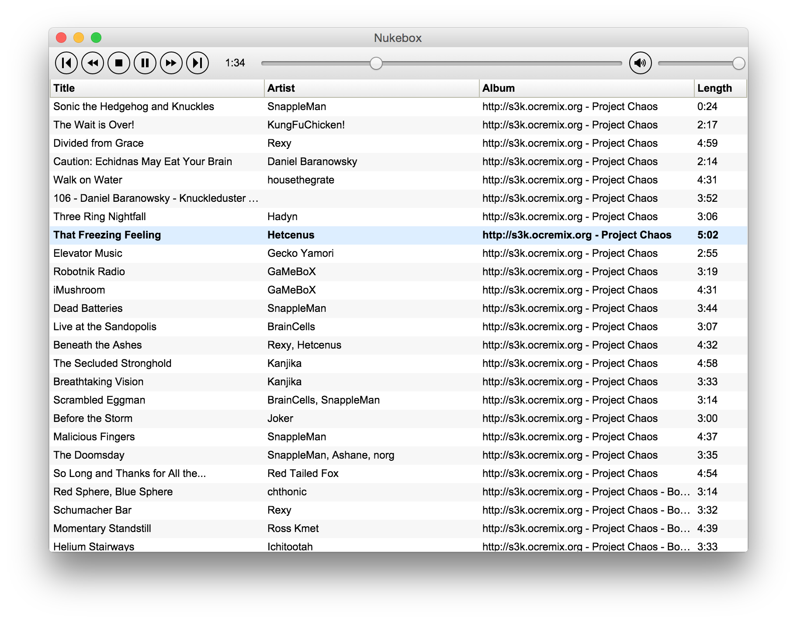

# Nukebox

Nukebox is a music player built using [Electron](https://github.com/atom/electron/) and
[dgrid](http://dgrid.io/).

# Build Instructions

## Development

1. Clone this repository
1. `bower install`
1. `npm install`
1. `grunt dev`

## Release

Run `grunt release`

# Usage

## Running the Application

### Development

Run `bin/run` (or `bin/run.cmd` on Windows).

### Release

In the `electron` directory, run `nukebox.exe`, `Nukebox.app`, or `nukebox` (depending on OS).

## Adding Music

Currently the only way to add music is to drag it from Explorer / Finder / etc. into the grid.

## Keyboard Shortcuts

The following keyboard shortcuts are supported:

* Left Arrow:  Seek left 5 seconds
* Right Arrow:  Seek right 5 seconds
* Space:  Play / Pause
* Escape:  Stop

Additionally, the following keyboard shortcuts are available within the grid:

* Enter:  Play currently-focused track
* Backspace / Delete:  Remove currently-selected track(s)

## License

[MIT](./LICENSE)
